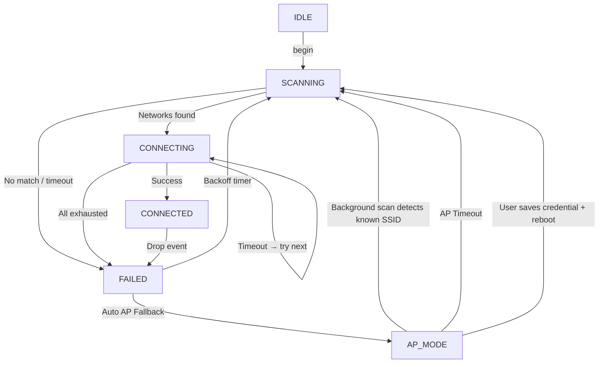

# ESPWiFiManager 🚀

[](https://opensource.org/licenses/MIT)
[](https://github.com/nazmuzchakib/ESPWiFiManager)
[](https://github.com/nazmuzchakib/ESPWiFiManager)

**ESPWiFiManager** is a modern, fully-featured, non-blocking Wi-Fi configuration library for **ESP32** and **ESP8266**.  
It handles the entire WiFi lifecycle automatically — scanning, connecting, fallback AP, background reconnection, and recovery — all without blocking your `loop()`.

---

## 🌟 What's New in v5

| Feature | v4 | v5 |
|---|---|---|
| Storage backend (ESP8266) | Raw EEPROM | **Preferences / NVS** (same as ESP32) |
| Max credentials (ESP8266) | 5 | **10** (configurable) |
| Auto AP Fallback | Manual in sketch | **Automatic** |
| AP+STA Dual Mode | ❌ | **✅** |
| Background reconnect from portal | ❌ | **✅** |
| Exponential backoff reconnection | ❌ | **✅** |
| Static IP support | ❌ | **✅** (persisted in NVS) |
| Event callbacks | ❌ | **✅** (`onConnected`, `onDisconnected`, etc.) |
| Dynamic log level/stream | ❌ | **✅** |
| Tx power / sleep control | ❌ | **✅** |
| AP timeout / auto-revert | ❌ | **✅** |
| `stopAPMode()` API | ❌ | **✅** |

---

## 🌟 Core Features

- **🧠 Smart Connect (RSSI Sorting):** Scans and connects to the strongest known network.
- **⚡ Non-blocking Architecture:** Pure state-machine approach. No `delay()` or `while()` loops.
- **📑 Multi-Credential Memory:** Up to **10** networks on both ESP32 and ESP8266 (unified NVS).
- **🔁 Auto AP Fallback:** Captive portal starts automatically on connection failure — no sketch boilerplate needed.
- **📡 Dual Mode (AP+STA):** Portal and background STA scanning run simultaneously.
- **🔄 Auto-Recovery:** Background scans detect known networks while portal is open and auto-reconnect.
- **📈 Exponential Backoff:** Smart reconnection with doubling intervals up to a configurable maximum.
- **🌐 Static IP Support:** Configure and persist a fixed IP/gateway/subnet/DNS.
- **🎯 Event Callbacks:** Register `std::function` callbacks for state changes, connect, disconnect, portal lifecycle.
- **📟 Serial Command Interface:** Human-readable `ADD`, `DEL`, `LIST`, `RECONNECT`, `APSTART`, `APSTOP`, `LOGLEVEL`, and more.
- **🔧 Low-Level Controls:** Tx power, WiFi sleep mode, AP channel, hidden SSID, max clients.
- **📊 Dynamic Logging:** Configurable log level, output stream, and custom log handler.

---

## 📂 Repository Layout

```text
ESPWiFiManager/
├── src/
│   ├── ESPWiFiManagerConfig.h  ← Build-time configuration (edit this)
│   ├── ESPWiFiManager.h        ← Main library header
│   ├── ESPWiFiManager.cpp      ← Core logic implementation
│   └── page_index.h            ← Embedded Web UI (auto-generated)
├── utils/
│   ├── index.html              ← Source HTML for the portal
│   └── html_to_header.py       ← HTML-to-Header conversion tool
├── example/
│   ├── BasicUsage/             ← Standard WebServer example
│   └── AsyncUsage/             ← ESPAsyncWebServer example
├── library.properties
└── README.md
```

---

## 🏗️ State Machine



---

## 🚀 Quick Start

### 1. Minimal Setup (Auto Everything)

```cpp
#include <ESPWiFiManager.h>
#include <WebServer.h>         // or ESPAsyncWebServer

WebServer   server(80);
WiFiManager wm("MyPortal", "12345678");

void setup() {
  Serial.begin(115200);

  // Register the server used for the captive portal
  wm.setAutoAPFallback(true, &server);

  // Register callbacks (optional but recommended)
  wm.onStationConnected([](const String& ssid, IPAddress ip) {
    Serial.printf("Connected: %s @ %s\n", ssid.c_str(), ip.toString().c_str());
    server.on("/hello", []() { server.send(200, "text/plain", "Hello!"); });
    wm.setServer(&server);
    server.begin();
  });

  wm.onAPModeStarted([](const String& ssid, IPAddress ip) {
    Serial.printf("Portal: connect to '%s' → http://%s\n",
                  ssid.c_str(), ip.toString().c_str());
  });

  wm.begin();  // begins scan automatically
}

void loop() {
  wm.process();  // that's all!
}
```

### 2. Static IP

```cpp
wm.setStaticIP(
  IPAddress(192, 168, 1, 100),   // IP
  IPAddress(192, 168, 1, 1),     // Gateway
  IPAddress(255, 255, 255, 0),   // Subnet
  IPAddress(8, 8, 8, 8)          // DNS
);
```

### 3. Low-Level Tuning

```cpp
wm.setTxPower(17.0f);          // 17 dBm
wm.setWiFiSleep(false);        // no modem sleep
wm.setAPConfig(6, false, 4);   // channel 6, visible SSID, max 4 clients
wm.setAPTimeout(3 * 60 * 1000); // revert to STA scan after 3 min
wm.setLogLevel(WIFI_LOG_DEBUG); // verbose logging
wm.setLogStream(Serial1);       // redirect logs to Serial1
```

### 4. Custom Log Handler

```cpp
wm.setLogHandler([](WiFiLogLevel level, const char* msg) {
  // Forward to MQTT, SD card, Telnet, etc.
  Serial.printf("[%d] %s\n", level, msg);
});
```

---

## 🛠️ Full Public API

### Core

| Method | Description |
|---|---|
| `begin()` | Init, register events, load static IP, kick off first scan. |
| `process()` | **Must be in `loop()`**. Drives the entire state machine. |
| `connectToWiFi()` | Start an async scan + smart-connect attempt. |
| `startAPMode(server)` | Start captive portal on provided server (dual AP+STA mode). |
| `stopAPMode()` | Stop portal, restore STA mode. |
| `setServer(&server)` | Attach your app's server so `process()` calls `handleClient()`. |

### State Query

| Method | Returns |
|---|---|
| `getState()` | Current `WiFiState` enum value. |
| `isConnected()` | `true` when in `WIFI_STATE_CONNECTED`. |
| `getLocalIP()` | STA IP address. |
| `getAPIP()` | Soft-AP IP address. |

### Credentials

| Method | Description |
|---|---|
| `addCredential(ssid, pass)` | Add or update. FIFO if limit reached. |
| `deleteCredential(ssid)` | Remove by SSID. |
| `clearCredentials()` | Erase all saved networks. |
| `listCredentialsToSerial()` | Print all SSIDs to log stream. |
| `getCredentialsJson()` | Return raw JSON string. |

### Static IP

| Method | Description |
|---|---|
| `setStaticIP(ip, gw, sn, dns1, dns2)` | Set and persist static IP. |
| `clearStaticIP()` | Revert to DHCP. |
| `hasStaticIP()` | `true` if a static IP is configured. |

### Behaviour

| Method | Description |
|---|---|
| `setAutoAPFallback(enable, &server)` | Auto-start portal on failure (default: true). |
| `setBackgroundReconnect(enable)` | Retry STA in background (default: true). |
| `setAPTimeout(ms)` | Revert to STA scan if portal is open > ms (0 = off). |

### Low-Level

| Method | Description |
|---|---|
| `setAPConfig(ch, hidden, maxClients)` | AP radio settings. |
| `setTxPower(dbm)` | Set transmission power (0–20.5 dBm). |
| `setWiFiSleep(enable)` | Enable/disable modem sleep. |

### Logging

| Method | Description |
|---|---|
| `setLogLevel(level)` | `WIFI_LOG_NONE / ERROR / INFO / DEBUG`. |
| `setLogStream(stream)` | Redirect output to any `Stream`. |
| `setLogHandler(cb)` | Custom `void(WiFiLogLevel, const char*)` handler. |

### Callbacks

| Method | Signature |
|---|---|
| `onStateChange(cb)` | `void(WiFiState old, WiFiState new)` |
| `onStationConnected(cb)` | `void(const String& ssid, IPAddress ip)` |
| `onStationDisconnected(cb)` | `void(int reason)` |
| `onAPModeStarted(cb)` | `void(const String& ssid, IPAddress ip)` |
| `onAPModeStopped(cb)` | `void()` |
| `onCredentialsChanged(cb)` | `void()` |

---

## ⌨️ Serial Commands

Prefix all commands with `WIFI ` (configurable in sketch):

| Command | Description |
|---|---|
| `WIFI ADD "SSID" "PASSWORD"` | Save or update a network |
| `WIFI DEL "SSID"` | Remove a saved network |
| `WIFI LIST` | List all saved SSIDs |
| `WIFI CLEAR` | Erase all credentials |
| `WIFI STATUS` | Print state + STA IP + AP IP |
| `WIFI RECONNECT` | Force an immediate reconnect cycle |
| `WIFI APSTART` | Force-start the captive portal |
| `WIFI APSTOP` | Shut down the portal, resume STA |
| `WIFI LOGLEVEL <0-3>` | Change log verbosity at runtime |

---

## ⚙️ Configuration (`ESPWiFiManagerConfig.h`)

| Define | Default | Description |
|---|---|---|
| `WIFIMANAGER_USE_ASYNC_WEBSERVER` | *(undefined)* | Uncomment to use ESPAsyncWebServer |
| `WIFIMANAGER_DEFAULT_LOG_LEVEL` | `2` (INFO) | Default log verbosity |
| `WIFIMANAGER_MAX_CREDENTIALS` | `10` | Max networks stored |
| `WIFIMANAGER_CONNECTION_TIMEOUT_MS` | `12000` | Per-network connect timeout |
| `WIFIMANAGER_SCAN_TIMEOUT_MS` | `15000` | Scan timeout |
| `WIFIMANAGER_RECONNECT_BASE_MS` | `5000` | Initial backoff interval |
| `WIFIMANAGER_RECONNECT_MAX_MS` | `300000` | Maximum backoff interval (5 min) |
| `WIFIMANAGER_AP_CHANNEL` | `1` | Default AP channel |
| `WIFIMANAGER_AP_MAX_CLIENTS` | `4` | Default max AP clients |
| `WIFIMANAGER_AP_TIMEOUT_MS` | `0` | AP timeout (0 = disabled) |
| `WIFIMANAGER_BG_SCAN_INTERVAL_MS` | `30000` | Background scan interval while portal is active |

---

## 🎨 Customizing the Portal

1. Edit `utils/index.html`.
2. Run: `python utils/html_to_header.py utils/index.html`
3. Recompile and flash.

> [!NOTE]
> The Python utility uses **Gzip (level 9)** compression to generate a memory-efficient C header.

---

## ⚠️ Troubleshooting

> [!TIP]
> **Portal not appearing?** Ensure your phone is connected to the device's AP. If no auto-redirect, visit `192.168.4.1` manually.

> [!IMPORTANT]
> **ESP8266 Preferences library**: Requires ESP8266 Arduino core **≥ 3.0.0**. Update via Arduino Board Manager if needed.

> [!TIP]
> **Increase log verbosity** with `wm.setLogLevel(WIFI_LOG_DEBUG)` to see all internal state transitions and scan results.

---

## 📜 License

MIT License — free for personal and commercial use.

---

*Developed by **Cypher-Z** — Helping you build smarter IoT solutions.*
