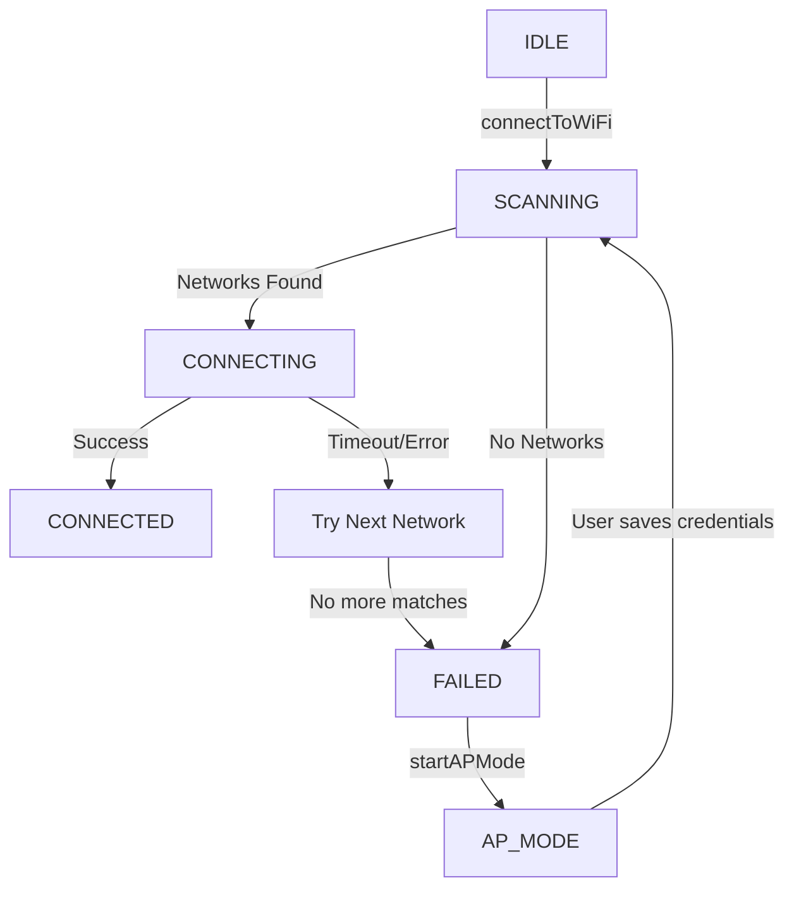

# ESPWiFiManager 🚀

[](https://opensource.org/licenses/MIT)
[](https://github.com/nazmuzchakib/ESPWiFiManager)
[](https://github.com/nazmuzchakib/ESPWiFiManager)

**ESPWiFiManager** is a lightweight, smart, and non-blocking Wi-Fi configuration library for **ESP32** and **ESP8266**. It features a modern web-based captive portal and a powerful serial command interface, allowing you to manage multiple Wi-Fi credentials seamlessly at runtime.

---

## 🌟 Features

- **🧠 Smart Connect (RSSI Sorting):** Automatically scans and connects to the strongest known network in range.
- **⚡ Non-blocking Architecture:** Designed with a state-machine approach. No `delay()` or `while()` loops that freeze your main logic.
- **📑 Multi-Credential Memory:** 
  - **ESP32:** Stores up to **10** networks using Preferences (NVS).
  - **ESP8266:** Stores up to **5** networks using EEPROM.
  - **FIFO Logic:** Automatically overwrites the oldest network when the limit is reached.
- **🌐 Web-based Captive Portal:** 
  - Automated redirection to setup page.
  - Built-in API for scan, save, list, and delete operations.
  - Fully customizable HTML/CSS/JS.
- **📟 Serial Command Interface:** Manage Wi-Fi via Serial Monitor using human-readable commands (e.g., `ADD "MySSID" "MyPass"`).
- **🛠️ Developer-Friendly:** No complex dependencies except `ArduinoJson`.
- **🐍 Conversion Utility:** Includes a Python script to compress and convert your HTML designs into C++ header files.

---

## 📂 Repository Layout

```text
ESPWiFiManager/
├── src/
│   ├── ESPWiFiManager.h        <- Main library header
│   ├── ESPWiFiManager.cpp      <- Core logic implementation
│   └── page_index.h            <- Embedded Web UI (Generated)
├── utils/
│   ├── index.html              <- Source HTML for the portal
│   └── html_to_header.py       <- HTML-to-Header conversion tool
├── examples/
│   └── BasicUsage/             <- Standard implementation example
├── library.properties          <- Metadata for Arduino IDE
└── README.md                   <- This file
```

---

## 🏗️ How it Works (The State Machine)

The library moves through several states to ensure a smooth user experience without blocking your code.



---

## 🚀 Quick Start

### 1. Basic Implementation
Here is the core logic required to get your device online.

```cpp
#include <ESPWiFiManager.h>

// WebServer instance (ESP32: WebServer.h, ESP8266: ESP8266WebServer.h)
#if defined(ESP32)
  #include <WebServer.h>
  WebServer server(80);
#else
  #include <ESP8266WebServer.h>
  ESP8266WebServer server(80);
#endif

// Initialize Manager: (AP_SSID, AP_Password)
WiFiManager wifiManager("Config_Portal", "12345678");

void setup() {
  Serial.begin(115200);
  
  // 1. Initialize internals
  wifiManager.begin();
  
  // 2. Trigger connection attempt
  wifiManager.connectToWiFi();
}

void loop() {
  // 3. Keep the manager processing (Essential!)
  wifiManager.process();

  // Handle various states
  WiFiState state = wifiManager.getState();
  
  if (state == WIFI_STATE_CONNECTED) {
    // Successfully connected!
    // wifiManager.setServer(&server); // Optional: Rebind if you want to use the server for other things
  } 
  else if (state == WIFI_STATE_FAILED) {
    // Connection failed, let's start the AP portal
    wifiManager.startAPMode(server);
  }
  
  // Handle Serial Commands (Optional)
  if (Serial.available()) {
    wifiManager.executeCommand(Serial.readStringUntil('\n'));
  }
}
```

---

## 🛠️ Public API Overview

| Method | Description |
| :--- | :--- |
| `begin()` | Loads saved credentials and initializes hardware. |
| `connectToWiFi()` | Triggers an RSSI-sorted scan and connection attempt. |
| `process()` | **Must be called in `loop()`**. Handles timing and state transitions. |
| `startAPMode(server)` | Starts the SoftAP and configures Captive Portal routes. |
| `setServer(&server)` | Attaches the manager to your existing web server instance. |
| `getState()` | Returns current state (`WIFI_STATE_CONNECTED`, `WIFI_STATE_AP_MODE`, etc.). |
| `executeCommand(cmd)` | Parses and executes a command string (Serial/Console). |

---

## ⌨️ Serial Commands

Open your Serial Monitor (115200 baud) and send these commands:

- `ADD "SSID" "PASSWORD"` : Saves a new network.
- `DEL "SSID"` : Deletes a saved network.
- `LIST` : Shows all saved credentials.
- `CLEAR` : Deletes all saved networks.
- `STATUS` : Prints current connection status and IP address.

---

## 🎨 Customizing the Portal

1. **Design:** Modify `utils/index.html` to your liking. (The library expects `index.html` to generate `page_index.h`).
2. **Convert:** Run the Python utility to compress and update the embedded C++ header using Gzip:
   ```bash
   python utils/html_to_header.py utils/index.html
   ```
   *The script will automatically create/update `src/page_index.h`.*
3. **Flash:** Recompile and upload your code to the ESP device.

> [!NOTE]
> The Python utility uses **Gzip compression (level 9)** to transform your HTML into a memory-efficient C header, significantly reducing the flash footprint.

---

## ⚠️ Troubleshooting

> [!TIP]
> **Captive Portal not appearing?**
> Ensure your phone/PC is connected to the device's Access Point. If the browser doesn't auto-redirect, manually visit `192.168.4.1`.

> [!IMPORTANT]
> **ESP8266 Memory Limit:**
> ESP8266 is limited to 5 credentials due to EEPROM sizing. Keep your SSIDs and passwords reasonably short to ensure data integrity.

- **Fails to Connect:** Check if the signal strength (RSSI) of your router is too weak.
- **Serial Commands Not Working:** Ensure your line ending is set to `Newline` or `Both NL & CR` in the Serial Monitor.

---

## 📜 License
This library is licensed under the **MIT License**. Feel free to use it in your personal or commercial projects.

---
*Developed by **Cypher-Z** - Helping you build smarter IoT solutions.*
